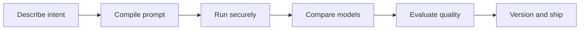
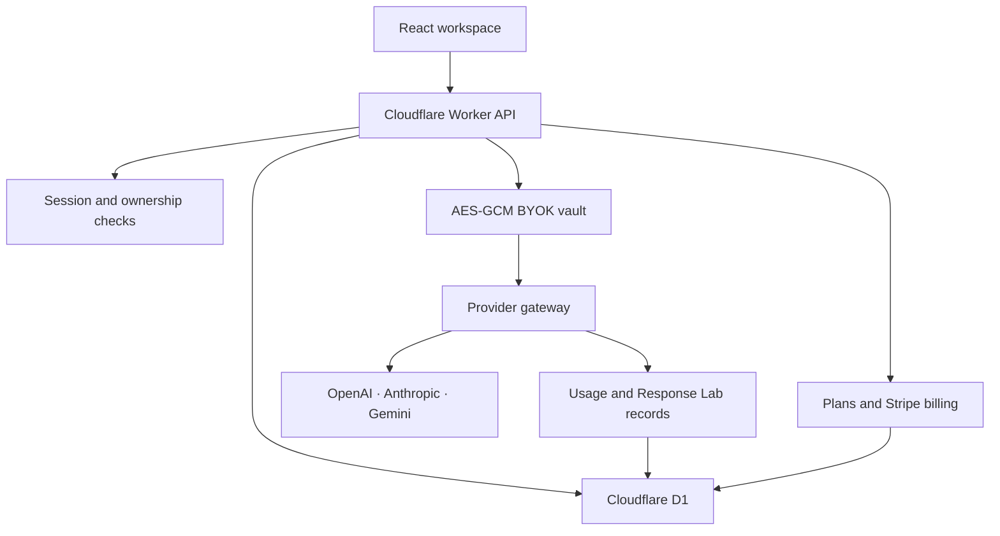

# Instruxa

<p align="center">
  <strong>Engineering-grade prompt infrastructure for serious AI builders.</strong>
</p>

<p align="center">
  Compile intent into structured prompts, execute securely across leading model providers, compare responses, and turn successful experiments into versioned AI assets.
</p>

<p align="center">
  <a href="https://still-darkness-9403.veerendra-kalyanbabu.workers.dev/"><strong>Launch Instruxa</strong></a>
  · <a href="docs/ARCHITECTURE.md">Architecture</a>
  · <a href="docs/ROADMAP.md">Roadmap</a>
  · <a href="SECURITY.md">Security</a>
</p>

<p align="center">
  <a href="https://github.com/veerendrakalyanbabu-VKB/Instruxa/actions/workflows/ci.yml"></a>
  
  
  
  
</p>

> [!IMPORTANT]
> Instruxa is an actively developed private-beta product. Authentication, saved projects, encrypted BYOK, multi-model execution, usage tracking, Response Lab, and Stripe sandbox billing are implemented. Live billing and enterprise collaboration are not active.

## What Instruxa does

Instruxa treats prompts like production assets instead of disposable chat messages.



The compiler turns a goal, audience, tone, and model target into a complete instruction contract containing a role, objective, constraints, output format, validation criteria, and quality bar.

## Product capabilities

| Capability | Status |
|---|---|
| Structured prompt compiler | Available |
| Premium responsive workspace | Available |
| D1-backed accounts and secure sessions | Available |
| Private projects and immutable version snapshots | Available |
| OpenAI, Anthropic, and Gemini provider adapters | Available |
| AES-256-GCM encrypted bring-your-own keys | Available |
| Gemini Interactions API integration | Available |
| Token, latency, credit, and status tracking | Available |
| Automatic transient-provider retries | Available |
| Safe Markdown response rendering and export | Available |
| D1-backed Response Lab history | Migration 0003 |
| Deterministic response quality evaluation | Migration 0003 |
| Side-by-side connected-model comparison | Migration 0003 |
| Real normalized provider streaming | Available |
| Persistent winner selection | Migration 0004 |
| Best-response synthesis | Available after comparison |
| Usage and intelligence dashboard | Available |
| Public pricing and account-aware plan CTAs | Available |
| Privacy, Terms, and Security trust-center routes | Available; legal review required before paid launch |
| Teams, roles, approvals, and audit trails | Planned |
| Plan entitlements and credit ledger | Migration 0005 |
| Stripe checkout and signed webhooks | Sandbox configured; end-to-end verification required |
| Stripe Customer Portal | Operator configuration and sandbox verification required |

## Response Lab

The Response Lab is the next stage of the product workflow:

- Persist successful runs to the authenticated user account
- Record provider, model, access mode, tokens, latency, and timestamp
- Score structure, completeness, actionability, and prompt-constraint fit
- Compare responses from connected providers side by side
- Reopen previous runs across sessions and devices
- Keep provider credentials outside response history

The first evaluator is intentionally deterministic and explainable. Model-assisted judges and reusable evaluation datasets remain roadmap items.

## Usage and intelligence

The authenticated dashboard aggregates private D1 telemetry across selectable 7, 30, and 90-day windows:

- Runs, success rate, failures, tokens, and average latency
- BYOK versus included-credit activity
- Provider distribution and model usage
- Explainable quality trajectory
- Included-credit balance
- Response Lab winner leaderboard

Analytics queries are evaluated server-side and scoped to the authenticated account.

## Monetization foundation

Instruxa has a server-authoritative commercial layer rather than trusting prices or balances from the browser:

- Free, Pro, and Team entitlement policies
- Per-plan project and generation-rate enforcement
- Stripe Checkout for subscriptions and credit packs
- Stripe Billing Portal sessions for customer self-service
- Signed webhook verification with a five-minute replay window
- Idempotent subscription grants, renewals, and credit purchases
- Immutable user-scoped credit ledger
- Automatic included-credit refund records for failed AI executions

The code is production-oriented, but live charges remain disabled until the operator applies migration 0005 and configures Stripe products, webhook signing, and runtime secrets.

## Security architecture

- Passwords are salted and derived with PBKDF2-SHA-256 inside the Worker.
- Session cookies are `HttpOnly`, `Secure`, `SameSite=Lax`, and backed by stored token digests.
- Provider keys are encrypted using AES-256-GCM before D1 persistence.
- The BYOK master key exists only as a Cloudflare Worker runtime secret.
- Provider keys are decrypted only for an authenticated request inside the Worker.
- All project, key, usage, and run-history queries are scoped to the authenticated user.
- API responses containing private data use `Cache-Control: no-store`.
- Provider overloads receive bounded retries with exponential backoff.
- Real credentials and private prompts must never be committed to the repository.

See [SECURITY.md](SECURITY.md) for reporting guidance and current limitations.

## Architecture



| Layer | Technology |
|---|---|
| Interface | React 19, TypeScript, Tailwind CSS |
| Application structure | Next.js-compatible App Router |
| Edge runtime | Vinext on Cloudflare Workers |
| Persistence | Cloudflare D1 / SQLite |
| AI providers | OpenAI Responses, Anthropic Messages, Gemini Interactions |
| UI primitives | shadcn/ui, Lucide React |
| Quality | ESLint, TypeScript, GitHub Actions |

Detailed boundaries and data flows are documented in [docs/ARCHITECTURE.md](docs/ARCHITECTURE.md).

## Local development

### Requirements

- Node.js 22.13 or newer
- npm
- A Cloudflare account for Worker and D1 integration

```bash
git clone https://github.com/veerendrakalyanbabu-VKB/Instruxa.git
cd Instruxa
npm install
npm run dev
```

Quality checks:

```bash
npm run lint
npm run build
npm test
```

## Cloudflare deployment

Create a D1 database named `instruxa` and bind it to the Worker as `DB`. Apply migrations in order:

```bash
npx wrangler d1 execute instruxa --remote --file=migrations/0001_accounts_projects.sql
npx wrangler d1 execute instruxa --remote --file=migrations/0002_ai_gateway.sql
npx wrangler d1 execute instruxa --remote --file=migrations/0003_response_lab.sql
npx wrangler d1 execute instruxa --remote --file=migrations/0004_response_winners.sql
npx wrangler d1 execute instruxa --remote --file=migrations/0005_monetization.sql
```

Configure `BYOK_MASTER_KEY` as a Worker runtime secret. It must be valid Base64 that decodes to exactly 32 bytes. Optional platform-funded access uses:

- `OPENAI_API_KEY`
- `ANTHROPIC_API_KEY`
- `GEMINI_API_KEY`

Never add provider credentials or the master key as repository files or plaintext build variables.

Stripe billing is optional and fail-closed. Configure these as Worker runtime secrets or variables only when the Stripe products exist:

- `BILLING_MODE` — use `test` during verification; omit it or set `disabled` to keep checkout closed
- `STRIPE_SECRET_KEY` — sandbox server key; prefer a least-privilege `rk_test_…` restricted key over a full-access `sk_test_…` key
- `STRIPE_WEBHOOK_SECRET` — signing secret for `POST /api/billing/webhook`
- `STRIPE_PRICE_PRO` and `STRIPE_PRICE_TEAM` — recurring Price IDs
- `STRIPE_PRICE_CREDITS_100`, `STRIPE_PRICE_CREDITS_500`, and `STRIPE_PRICE_CREDITS_2000` — one-time Price IDs
- `APP_URL` — canonical HTTPS production origin used for checkout returns

Do not set `BILLING_MODE=live` until webhook delivery, renewals, cancellations, refunds, and reconciliation have passed in Stripe test mode. Test keys cannot activate live mode, and live keys cannot activate test mode.

### Stripe test-mode activation

1. Apply `migrations/0005_monetization.sql` to the production D1 database.
2. In Stripe test mode, create recurring monthly Prices for Pro and Team plus one-time Prices for the three credit packs.
3. Add a webhook endpoint at `https://<worker-domain>/api/billing/webhook` for Checkout Session, Subscription, and Invoice events.
4. Add `BILLING_MODE=test`, the `sk_test_…` secret, webhook signing secret, Price IDs, and canonical `APP_URL` as Worker runtime configuration.
5. Redeploy, confirm the UI explicitly says test mode, and complete the operator checks in [docs/BILLING_RUNBOOK.md](docs/BILLING_RUNBOOK.md).

The connected Cloudflare build uses:

| Setting | Value |
|---|---|
| Production branch | `main` |
| Build command | `npm run build` |
| Deploy command | `npx wrangler deploy` |
| Root directory | `/` |

## Repository structure

| Path | Responsibility |
|---|---|
| `app/` | Product surface and design system |
| `components/` | Account, compiler, model runner, analytics, and billing surfaces |
| `worker/` | Authentication, projects, encrypted model gateway, billing orchestration |
| `migrations/` | Ordered D1 schema migrations |
| `docs/` | Architecture and roadmap |
| `tests/` | Behavioral and security-focused tests |
| `.github/workflows/` | Continuous integration |

## Engineering principles

1. Fail closed for authentication and ownership checks.
2. Keep credentials server-side and encrypted at rest.
3. Make metering and commercial state authoritative on the server.
4. Prefer explainable evaluation signals before opaque scoring.
5. Preserve a deterministic, zero-provider-cost compiler path.
6. Document implemented, partial, and planned capabilities honestly.
7. Optimize for accessibility, performance, reduced motion, and mobile use.

Public product claims must describe implemented behavior. Planned team and governance capabilities belong in the roadmap until their enforcement exists in production.

## Roadmap

The next product milestones are Stripe test-mode activation, richer evaluation datasets, project-linked experiments, team workspaces, and governance. See [docs/ROADMAP.md](docs/ROADMAP.md).

## Contributing

Instruxa is currently owner-led. Read [CONTRIBUTING.md](CONTRIBUTING.md) before proposing changes. Security reports must follow [SECURITY.md](SECURITY.md) and must not be posted publicly.

## Ownership

Copyright © 2026 K. Veerendra Kalyan Babu. All rights reserved.

No license is granted for commercial reuse, redistribution, or derivative products without written permission.
