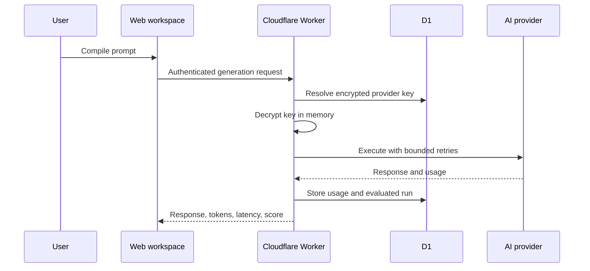

# Instruxa Architecture

## System overview

Instruxa combines a deterministic prompt compiler with an authenticated, server-side multi-provider execution gateway.

## Runtime boundaries

| Boundary | Responsibility |
|---|---|
| React workspace | Prompt authoring, projects, provider controls, rendered responses, comparisons |
| Worker API | Authentication, authorization, validation, rate limiting, orchestration |
| D1 | Users, sessions, projects, versions, encrypted keys, credits, billing state, usage, run history |
| BYOK vault | AES-256-GCM encryption and request-scoped decryption |
| Provider gateway | OpenAI, Anthropic, Gemini adapters, retries, normalized output |
| Response Lab | Durable run retrieval, deterministic evaluation, model comparison |
| Intelligence dashboard | User-scoped aggregation of usage, quality, latency, access mode, and winners |
| Billing service | Entitlements, Stripe sessions, signed webhooks, fulfillment, and credit ledger |

## Data model

Migrations are ordered and additive:

1. `0001_accounts_projects.sql` — users, sessions, projects, project versions
2. `0002_ai_gateway.sql` — provider keys, credit accounts, usage events
3. `0003_response_lab.sql` — durable evaluated AI runs
4. `0004_response_winners.sql` — persistent Response Lab winners
5. `0005_monetization.sql` — subscriptions, immutable credit ledger, billing event receipts

Every private record carries a user ownership boundary directly or through a foreign key. API queries always include the authenticated user identifier.

## Identity and sessions

- Passwords use PBKDF2-SHA-256 with a unique 128-bit salt.
- Session tokens contain 256 bits of randomness.
- D1 stores only the SHA-256 digest of each session token.
- Cookies are `HttpOnly`, `Secure`, `SameSite=Lax`, and expire after 30 days.
- Protected routes resolve the user before accessing projects or AI services.

## Encrypted BYOK

1. The browser submits a provider key over HTTPS.
2. The Worker imports the Base64 runtime master secret as an AES-GCM key.
3. A random 96-bit IV is created for every encryption.
4. D1 stores ciphertext, IV, provider, and only the final four display characters.
5. Generation requests decrypt the key inside the Worker.
6. Plaintext provider keys are never returned to the browser or written to usage history.

## Provider execution

| Provider | API |
|---|---|
| OpenAI | Responses API |
| Anthropic | Messages API |
| Gemini | Interactions API with `store: false` |

Provider SSE events are normalized into an NDJSON stream consumed progressively by the workspace. Completed streams are accumulated, metered, evaluated, and persisted before the final event is emitted.

Transient status codes `408`, `429`, `500`, `502`, `503`, and `504` receive bounded exponential-backoff retries. Non-transient provider errors are returned without retry amplification.

## Response evaluation

The current evaluator is deterministic and explainable. It calculates:

- Structure
- Completeness
- Actionability
- Prompt-constraint fit
- Overall score

Signals come from observable response features such as headings, action lists, implementation examples, comparison tables, required sections, and response coverage. Scores are product guidance, not factual correctness guarantees.

## Credit and usage flow

Included access performs an atomic balance decrement before execution. A failed provider call refunds the credit. BYOK calls record usage without deducting included credits. Usage events record provider, model, mode, tokens, latency, status, and bounded error classification.

After migration 0005, every included-credit debit and refund is also recorded in the immutable credit ledger. Plan state is resolved server-side before project creation and generation rate checks. Missing or inactive paid-plan state falls back to Free limits.

## Billing flow

1. An authenticated user requests a subscription or credit-pack checkout session.
2. The Worker selects the operator-configured Stripe Price ID; the browser cannot submit an amount.
3. Stripe hosts payment collection and returns events to `/api/billing/webhook`.
4. The Worker verifies the HMAC-SHA256 signature and rejects stale or unsigned payloads.
5. D1 records the event receipt before fulfillment and prevents duplicate event processing.
6. Subscription state and credit grants are persisted using user-scoped, idempotent references.
7. The billing center reads the authoritative subscription, entitlements, balance, and ledger from D1.

Checkout is fail-closed when Stripe runtime configuration is incomplete. No payment credentials or raw webhook payloads are stored in D1.

## Analytics

`GET /api/ai/analytics` accepts a bounded 7, 30, or 90-day window. D1 aggregates usage and provider metrics using authenticated user ownership. Quality and winner signals are derived from that user's Response Lab records. No cross-account totals are exposed.

## Reliability and privacy

- Same-origin authenticated APIs
- `Cache-Control: no-store` for JSON responses
- Per-user generation rate limiting
- Prompt-length and model-identifier bounds
- Provider retry limits
- Failed-call credit refunds
- Signed and replay-bounded billing webhooks
- Idempotent external-event fulfillment
- D1 foreign keys and ordered migrations
- No credentials in logs or repository files
- Response Lab writes are backward-compatible before migration 0003

## Known limitations

- Password reset and email verification are not implemented.
- Model comparison requires at least two connected provider keys.
- The evaluator measures response construction, not ground-truth factual accuracy.
- Stripe code is present, but live billing is inactive until operator configuration and test-mode verification are complete.
- Teams, RBAC, and audit trails are not active.
